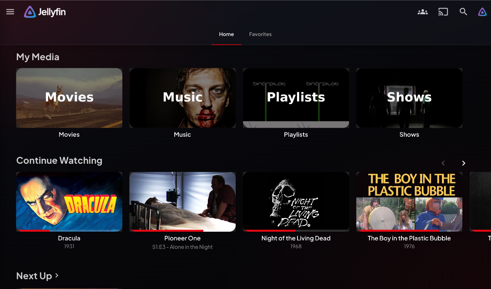
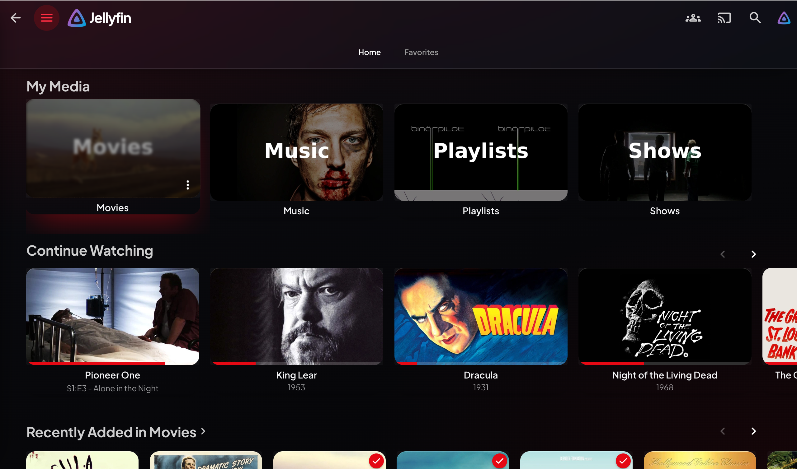
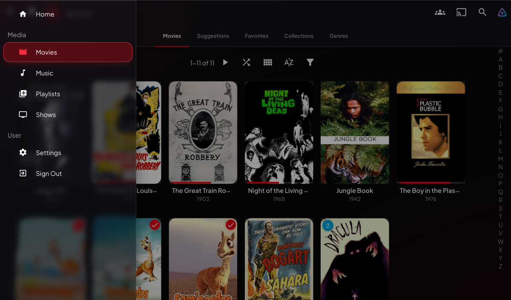
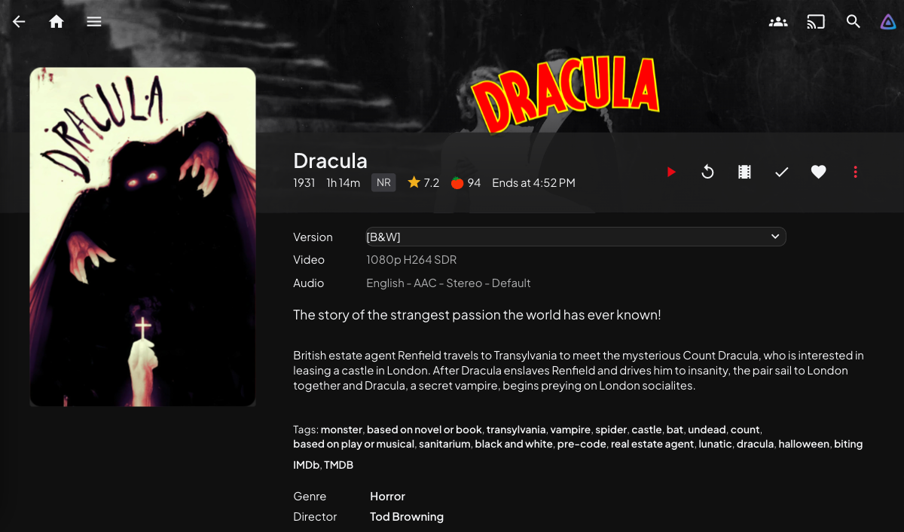
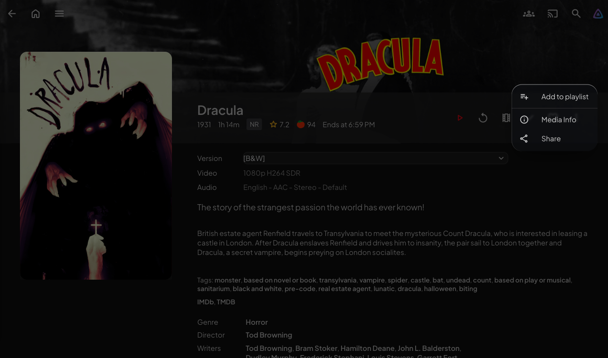
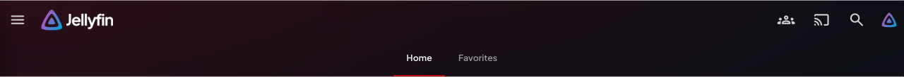

<div align="center">

# 💧 Liquidfin

**Liquid Glass for Jellyfin** — the iOS 26 *beta-1* look (max translucency, real refraction, crimson accent), built for Jellyfin 10.11.

Maximum translucency · bright specular edges · real light refraction on Chromium · floating glass panels

Built and verified against **Jellyfin 10.11.x** (latest stable).

</div>

---

## Preview

> Early captures on Chromium (refraction active). The look has since been refined — crimson tab lozenge, cinematic detail hero, player + library glass — so treat these as indicative.

| Home | Card hover — crimson bloom + glass sheen |
|:---:|:---:|
|  |  |
| **Nav drawer — glass + crimson pill** | **Detail / hero** |
|  |  |
| **Dialog — glass + edge refraction** | **Crimson focus & indicators** |
|  |  |

---

## What it looks like

A faithful take on the original (beta-1) Liquid Glass look — the most glassy version, before Apple frosted it up for legibility:

- **Translucent panels** — the header, nav drawer, dialogs, menus, now-playing bar and login card become strongly see-through glass; your library art shows through.
- **Specular rims** — every glass surface gets the bright, light-catching edge highlight that defines Liquid Glass.
- **Real refraction** — on Chromium-engine clients the content behind the glass actually *bends and lenses at the edges*, with a faint chromatic fringe at the rim — driven by a baked edge-concentrated displacement map plus three per-channel `feDisplacementMap` passes (the same approach as the best web recreations of Liquid Glass). The center stays crystal clear; only the rim refracts. On other engines it cleanly falls back to frosted glass.
- **Crimson, the glass way** — the accent isn't flat red. Primary buttons are crimson *liquid glass*; the active section tab is a crimson glass lozenge; sliders, progress, indicators, focus rings and card-hover blooms all glow crimson.
- **Floating, rounded geometry** and a spring hover lift on cards, with depth from layered light (not borders).
- **Premium end-to-end** — the polish doesn't stop at the home screen:
  - **Detail pages** get a cinematic key-art hero (dark behind the header, the artwork floating on its own ambient bloom), an outlined certification chip and a gradient rating star, and glass metadata panels.
  - **The video player** gets a frosted OSD bar, a crimson liquid-glass scrubber with a lit knob, and glass Up-Next / Skip-Intro / stats overlays.
  - **Library views** get glass alphabet-rail + pagination, a crimson "filters active" affordance, and a glass empty-state.

---

## Install

> Custom CSS lives in **Dashboard → Branding → Custom CSS** on Jellyfin 10.11.x. It applies server-wide to every client that loads Jellyfin Web. Changes apply on save (refresh the page).

### Option A — `@import` from a CDN (recommended)

Paste this **one line** into Dashboard → Branding → Custom CSS — it's already published (public repo + jsDelivr CDN):

```css
@import url('https://cdn.jsdelivr.net/gh/cj-vana/liquidfin@main/theme.css');
```

Pushing to [the repo](https://github.com/cj-vana/liquidfin) updates the theme everywhere (jsDelivr caches `@main` — purge it or pin a tag, see below).

> **Caching:** jsDelivr caches `@main` aggressively (and a `?v=N` query only busts the *browser* cache, not jsDelivr's). For a deterministic, instantly-cached load, **pin a specific commit** instead of `@main`:
>
> ```css
> @import url('https://cdn.jsdelivr.net/gh/cj-vana/liquidfin@d253065/theme.css');
> ```
>
> …and bump the hash when you want updates, or [purge the jsDelivr cache](https://www.jsdelivr.com/tools/purge) after a push to `@main`. Behind a reverse proxy with strict CSP you only need to allow `cdn.jsdelivr.net` — the theme uses **no web fonts and no external assets** (it renders in your system font), so nothing else needs allow-listing.

### Option B — paste the whole file (no hosting)

Open [`theme.css`](./theme.css), copy the entire contents, and paste it into Dashboard → Branding → Custom CSS. Fully offline — **no external fonts or assets** of any kind.

---

## Customizing

Everything is driven by CSS variables in the `:root` block at the top of `theme.css`. The easiest way to tweak without editing the file: paste your overrides **after** the `@import` line in the Branding field. For example:

```css
@import url('https://cdn.jsdelivr.net/gh/cj-vana/liquidfin@main/theme.css');

:root {
  --lg-accent:        #7c5cfc;   /* switch crimson -> violet */
  --lg-accent-bright: #9b80ff;
  --lg-accent-glow:   rgba(124, 92, 252, 0.45);
  --lg-blur:          22px;      /* more frost */
  --lg-scrim:         0.4;       /* less text scrim = more beta-1 purity */
}
```

| Token | Does |
|---|---|
| `--lg-accent` / `--lg-accent-bright` / `--lg-accent-glow` | The brand color and its hover/glow |
| `--lg-tint` / `--lg-tint-strong` / `--lg-film` | How see-through the glass is (lower alpha = more beta-1) |
| `--lg-blur` | Frosted-glass blur strength (fallback path) |
| `--lg-rim` / `--lg-rim-hi` | Hairline border + specular top highlight |
| `--lg-bg` / `--lg-backdrop-dim` | Page background gradient + how much library backdrops are dimmed |
| `--lg-scrim` | Text legibility scrims behind hero text. `0` = full beta-1 purity |
| `--lg-radius-*` | Corner roundness |
| `--lg-font` | UI font (defaults to the native system stack — SF / Segoe / Roboto; no web fonts) |

---

## Where the refraction lands

The real edge-refraction needs a **Chromium/Blink** engine. Everything else automatically gets the frosted-glass + specular fallback — it still looks like Liquid Glass, just without the lensing.

| Client | Engine | Refraction | Frosted fallback |
|---|---|:---:|:---:|
| Chrome / Edge / Brave / Opera (desktop) | Blink | ✅ | ✅ |
| Android mobile web + Jellyfin for Android (WebView) | Blink | ✅* | ✅ |
| Jellyfin Desktop 2.0 (CEF) / modern JMP (Qt6) | Blink | ✅ | ✅ |
| Tizen / webOS / Android TV (web UI) | Blink | ⚠️ TV GPU | ✅ (auto-reduced) |
| Safari / **any iOS browser** / Jellyfin iOS (WKWebView) | WebKit | ❌ | ✅ |
| Firefox | Gecko | ❌ | ✅ |
| Swiftfin, Kodi, Roku, Findroid (native) | — | ❌ | ❌ (Custom CSS not loaded) |

\* depends on the device's System WebView version. On smart-TVs the theme automatically drops refraction and heavy blur (`body.layout-tv`) to protect framerate.

---

## Performance / "lite" mode

`backdrop-filter` (and especially the SVG refraction) is GPU work. This theme already:

- limits refraction to a handful of small, fixed panels (never every poster in a grid),
- lowers blur on phones (`body.layout-mobile`),
- drops refraction + heavy blur on smart-TVs (`body.layout-tv`).

To disable refraction everywhere, add after the import:

```css
:root { --lg-refract: blur(0); }
```

---

## Notes & limitations

- **Dark only** — glassmorphism doesn't translate to a light base.
- The **admin dashboard** uses React/MUI components; this theme targets both the legacy and MUI class families, but Jellyfin's React migration is ongoing, so expect minor unstyled corners in future point releases.
- A few selectors Jellyfin only exposes as utility-class chains (e.g. the login card) are inherently fragile across versions; they're used where no semantic hook exists.
- Verified against `jellyfin-web` `release-10.11.z` (10.11.10/10.11.11).

## License

MIT — do whatever you like.
